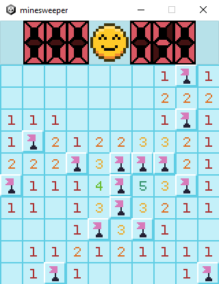
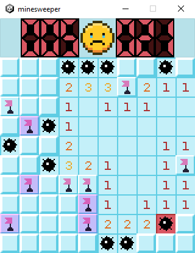
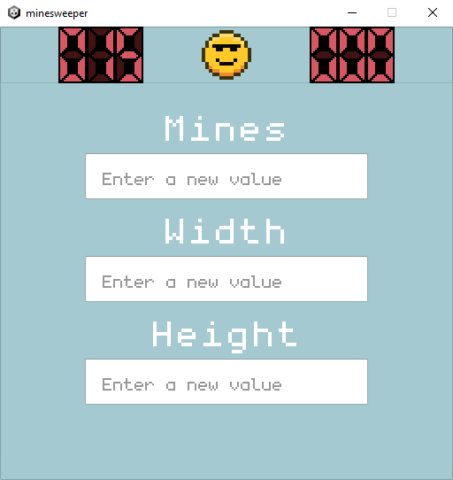
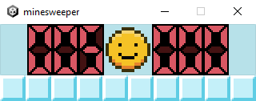
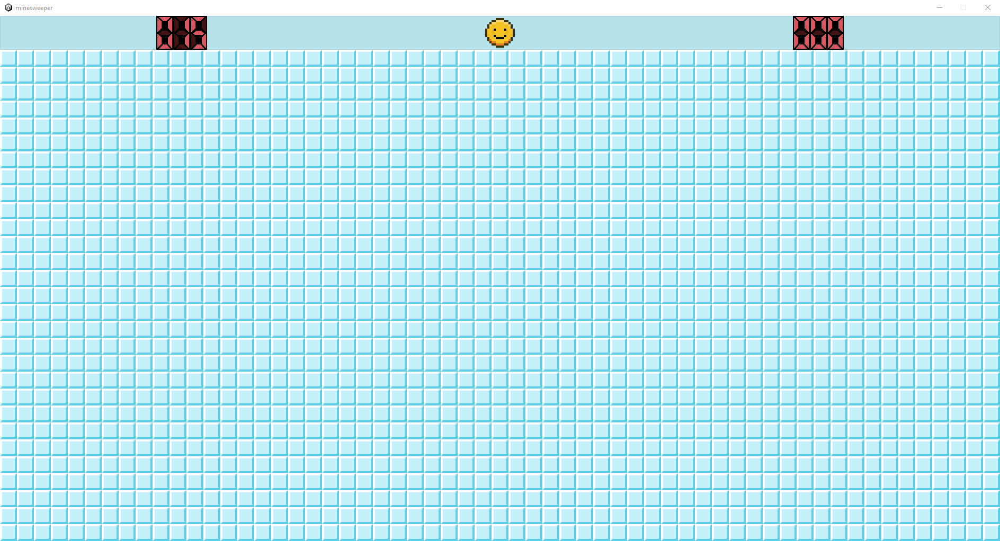

# minesweeper

A simple clone of Minesweeper but with settings.

To open the settings, right-click on the emoji button.

You may change the game parameters:
* width: 10 to x (depends on screen width)
* height: 1 to x (depends on screen height)
* mines: 0 to width * height

#

  
   
  <b>Win</b> 

  
   
  <b>Loss</b> 

  
   
  <b>Settings menu</b> 

  
   
  <b>Minimum possible field</b> 

  
   
  <b>Maximum possible field (depends on screen)</b> 

